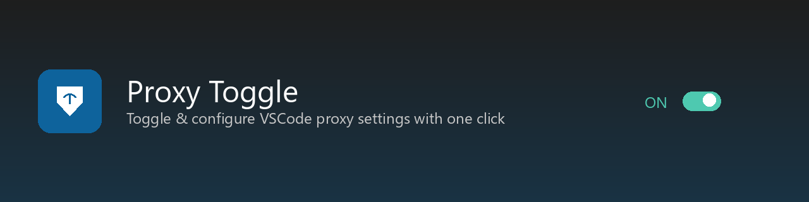

# Proxy Toggle



A simple and intuitive VSCode extension to toggle and configure proxy settings with a visual panel. No more digging through settings — just click the status bar button, edit your proxy configuration in a clean UI, and apply with one click.

## Features

- **Status bar toggle button** — Click to open the proxy configuration panel
- **Visual configuration panel** — Edit all proxy settings in a clean webview form
- **On/Off switch** — Toggle proxy on or off with a single switch
- **Bilingual UI** — Automatically detects VSCode display language (English / Persian)
- **Auto-apply** — Settings are applied to VSCode's `http.*` configuration instantly
- **Reload prompts** — Notifies you when a setting requires a window reload
- **Full HTTP proxy settings** — Manages all VSCode proxy-related settings

## Screenshots

### Status Bar Button
The proxy toggle button appears in the bottom-right status bar showing current state (`Proxy: ON` or `Proxy: OFF`).

### Configuration Panel
Click the status bar button to open the visual panel where you can:
- Toggle proxy on/off with a switch
- Edit proxy URL, authorization, and SSL settings
- Configure advanced settings like system certificates and network check intervals
- Save & apply all changes with one button

## Managed Settings

The extension manages the following VSCode HTTP settings:

| Setting | Description |
|---|---|
| `http.proxy` | Proxy address (e.g. `http://127.0.0.1:1080`) |
| `http.proxyAuthorization` | Authorization header for the proxy |
| `http.proxyStrictSSL` | Enable strict SSL verification |
| `http.proxySupport` | Proxy support mode: `off`, `on`, `fallback`, `override` |
| `http.noProxy` | Hosts excluded from proxy (comma-separated) |
| `http.useLocalProxyConfiguration` | Use local proxy config during remote development |
| `http.experimental.networkInterfaceCheckInterval` | Network interface check interval in seconds (default: 300, -1 to disable) |
| `http.experimental.systemCertificatesV2` | Experimental CA certificate loading from OS |
| `http.fetchAdditionalSupport` | Extend Node.js fetch with proxy and certificate support |
| `http.systemCertificates` | Load CA certificates from OS (reload required on Windows/macOS when turned off) |
| `http.systemCertificatesNode` | Load system certificates via Node.js built-in support (reload required) |

## Usage

1. **Open the panel**: Click the `Proxy: ON/OFF` button in the status bar (bottom-right), or run `Proxy Toggle: Open Proxy Panel` from the Command Palette (`Ctrl+Shift+P`).
2. **Toggle proxy**: Use the on/off switch at the top of the panel.
3. **Edit settings**: Modify any proxy settings in the form fields.
4. **Save & Apply**: Click the "Save & Apply" button to save and apply all changes.
5. **Reload if needed**: If a setting that requires a reload was changed, you'll be prompted to reload the window.

## Language Support

The extension automatically detects your VSCode display language:
- **Persian (`fa`)**: UI and settings descriptions appear in Persian (RTL layout)
- **English (default)**: All text in English (LTR layout)

To change VSCode language: `Ctrl+Shift+P` → `Configure Display Language`.

## Installation

### From Marketplace
Search for "Proxy Toggle" in the VSCode Extensions panel (`Ctrl+Shift+X`).

### From VSIX
```bash
code --install-extension proxy-toggle-0.0.2.vsix
```

### From Source
```bash
git clone https://github.com/Anushiravani/vscode-extensions.git
cd vscode-extensions/proxy-toggle
npm install
npx @vscode/vsce package
code --install-extension proxy-toggle-0.0.2.vsix
```

## Requirements

- VSCode 1.70.0 or later

## License

[MIT](LICENSE)

## Author

**Pouria Anoushiravani**
- Email: pouria56@gmail.com
- GitHub: [Anushiravani](https://github.com/Anushiravani)

## Issues & Feedback

Report issues or request features at [GitHub Issues](https://github.com/Anushiravani/vscode-extensions/issues).
